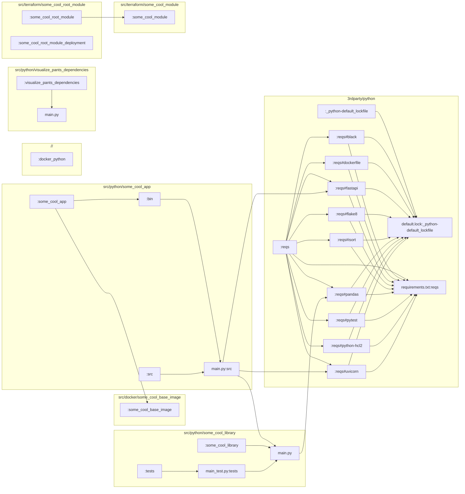

```mermaid
graph LR;
subgraph //;//:docker_python[:docker_python];end;
subgraph 3rdparty/python;3rdparty/python:_python-default_lockfile[:_python-default_lockfile];end;
subgraph 3rdparty/python;3rdparty/python:reqs[:reqs];end;
subgraph 3rdparty/python;3rdparty/python:reqs_POUND_black[:reqs#black];end;
subgraph 3rdparty/python;3rdparty/python:reqs_POUND_dockerfile[:reqs#dockerfile];end;
subgraph 3rdparty/python;3rdparty/python:reqs_POUND_fastapi[:reqs#fastapi];end;
subgraph 3rdparty/python;3rdparty/python:reqs_POUND_flake8[:reqs#flake8];end;
subgraph 3rdparty/python;3rdparty/python:reqs_POUND_isort[:reqs#isort];end;
subgraph 3rdparty/python;3rdparty/python:reqs_POUND_pandas[:reqs#pandas];end;
subgraph 3rdparty/python;3rdparty/python:reqs_POUND_pytest[:reqs#pytest];end;
subgraph 3rdparty/python;3rdparty/python:reqs_POUND_python-hcl2[:reqs#python-hcl2];end;
subgraph 3rdparty/python;3rdparty/python:reqs_POUND_uvicorn[:reqs#uvicorn];end;
subgraph 3rdparty/python;3rdparty/python/default.lock:_python-default_lockfile[default.lock:_python-default_lockfile];end;
subgraph 3rdparty/python;3rdparty/python/requirements.txt:reqs[requirements.txt:reqs];end;
subgraph src/docker/some_cool_base_image;src/docker/some_cool_base_image:some_cool_base_image[:some_cool_base_image];end;
subgraph src/python/some_cool_app;src/python/some_cool_app:some_cool_app[:some_cool_app];end;
subgraph src/python/some_cool_app;src/python/some_cool_app:bin[:bin];end;
subgraph src/python/some_cool_app;src/python/some_cool_app:src[:src];end;
subgraph src/python/some_cool_app;src/python/some_cool_app/main.py:src[main.py:src];end;
subgraph src/python/some_cool_library;src/python/some_cool_library:some_cool_library[:some_cool_library];end;
subgraph src/python/some_cool_library;src/python/some_cool_library:tests[:tests];end;
subgraph src/python/some_cool_library;src/python/some_cool_library/main.py[main.py];end;
subgraph src/python/some_cool_library;src/python/some_cool_library/main_test.py:tests[main_test.py:tests];end;
subgraph src/python/visualize_pants_dependencies;src/python/visualize_pants_dependencies:visualize_pants_dependencies[:visualize_pants_dependencies];end;
subgraph src/python/visualize_pants_dependencies;src/python/visualize_pants_dependencies/main.py[main.py];end;
subgraph src/terraform/some_cool_module;src/terraform/some_cool_module:some_cool_module[:some_cool_module];end;
subgraph src/terraform/some_cool_root_module;src/terraform/some_cool_root_module:some_cool_root_module[:some_cool_root_module];end;
subgraph src/terraform/some_cool_root_module;src/terraform/some_cool_root_module:some_cool_root_module_deployment[:some_cool_root_module_deployment];end;
3rdparty/python:_python-default_lockfile[:_python-default_lockfile] --> 3rdparty/python/default.lock:_python-default_lockfile[default.lock:_python-default_lockfile];
3rdparty/python:reqs[:reqs] --> 3rdparty/python/requirements.txt:reqs[requirements.txt:reqs];
3rdparty/python:reqs[:reqs] --> 3rdparty/python:reqs_POUND_black[:reqs#black];
3rdparty/python:reqs[:reqs] --> 3rdparty/python:reqs_POUND_dockerfile[:reqs#dockerfile];
3rdparty/python:reqs[:reqs] --> 3rdparty/python:reqs_POUND_fastapi[:reqs#fastapi];
3rdparty/python:reqs[:reqs] --> 3rdparty/python:reqs_POUND_flake8[:reqs#flake8];
3rdparty/python:reqs[:reqs] --> 3rdparty/python:reqs_POUND_isort[:reqs#isort];
3rdparty/python:reqs[:reqs] --> 3rdparty/python:reqs_POUND_pandas[:reqs#pandas];
3rdparty/python:reqs[:reqs] --> 3rdparty/python:reqs_POUND_pytest[:reqs#pytest];
3rdparty/python:reqs[:reqs] --> 3rdparty/python:reqs_POUND_python-hcl2[:reqs#python-hcl2];
3rdparty/python:reqs[:reqs] --> 3rdparty/python:reqs_POUND_uvicorn[:reqs#uvicorn];
3rdparty/python:reqs_POUND_black[:reqs#black] --> 3rdparty/python/default.lock:_python-default_lockfile[default.lock:_python-default_lockfile];
3rdparty/python:reqs_POUND_black[:reqs#black] --> 3rdparty/python/requirements.txt:reqs[requirements.txt:reqs];
3rdparty/python:reqs_POUND_dockerfile[:reqs#dockerfile] --> 3rdparty/python/default.lock:_python-default_lockfile[default.lock:_python-default_lockfile];
3rdparty/python:reqs_POUND_dockerfile[:reqs#dockerfile] --> 3rdparty/python/requirements.txt:reqs[requirements.txt:reqs];
3rdparty/python:reqs_POUND_fastapi[:reqs#fastapi] --> 3rdparty/python/default.lock:_python-default_lockfile[default.lock:_python-default_lockfile];
3rdparty/python:reqs_POUND_fastapi[:reqs#fastapi] --> 3rdparty/python/requirements.txt:reqs[requirements.txt:reqs];
3rdparty/python:reqs_POUND_flake8[:reqs#flake8] --> 3rdparty/python/default.lock:_python-default_lockfile[default.lock:_python-default_lockfile];
3rdparty/python:reqs_POUND_flake8[:reqs#flake8] --> 3rdparty/python/requirements.txt:reqs[requirements.txt:reqs];
3rdparty/python:reqs_POUND_isort[:reqs#isort] --> 3rdparty/python/default.lock:_python-default_lockfile[default.lock:_python-default_lockfile];
3rdparty/python:reqs_POUND_isort[:reqs#isort] --> 3rdparty/python/requirements.txt:reqs[requirements.txt:reqs];
3rdparty/python:reqs_POUND_pandas[:reqs#pandas] --> 3rdparty/python/default.lock:_python-default_lockfile[default.lock:_python-default_lockfile];
3rdparty/python:reqs_POUND_pandas[:reqs#pandas] --> 3rdparty/python/requirements.txt:reqs[requirements.txt:reqs];
3rdparty/python:reqs_POUND_pytest[:reqs#pytest] --> 3rdparty/python/default.lock:_python-default_lockfile[default.lock:_python-default_lockfile];
3rdparty/python:reqs_POUND_pytest[:reqs#pytest] --> 3rdparty/python/requirements.txt:reqs[requirements.txt:reqs];
3rdparty/python:reqs_POUND_python-hcl2[:reqs#python-hcl2] --> 3rdparty/python/default.lock:_python-default_lockfile[default.lock:_python-default_lockfile];
3rdparty/python:reqs_POUND_python-hcl2[:reqs#python-hcl2] --> 3rdparty/python/requirements.txt:reqs[requirements.txt:reqs];
3rdparty/python:reqs_POUND_uvicorn[:reqs#uvicorn] --> 3rdparty/python/default.lock:_python-default_lockfile[default.lock:_python-default_lockfile];
3rdparty/python:reqs_POUND_uvicorn[:reqs#uvicorn] --> 3rdparty/python/requirements.txt:reqs[requirements.txt:reqs];
src/python/some_cool_app:some_cool_app[:some_cool_app] --> src/docker/some_cool_base_image:some_cool_base_image[:some_cool_base_image];
src/python/some_cool_app:some_cool_app[:some_cool_app] --> src/python/some_cool_app:bin[:bin];
src/python/some_cool_app:bin[:bin] --> src/python/some_cool_app/main.py:src[main.py:src];
src/python/some_cool_app:src[:src] --> src/python/some_cool_app/main.py:src[main.py:src];
src/python/some_cool_app/main.py:src[main.py:src] --> 3rdparty/python:reqs_POUND_fastapi[:reqs#fastapi];
src/python/some_cool_app/main.py:src[main.py:src] --> 3rdparty/python:reqs_POUND_uvicorn[:reqs#uvicorn];
src/python/some_cool_app/main.py:src[main.py:src] --> src/python/some_cool_library/main.py[main.py];
src/python/some_cool_library:some_cool_library[:some_cool_library] --> src/python/some_cool_library/main.py[main.py];
src/python/some_cool_library:tests[:tests] --> src/python/some_cool_library/main_test.py:tests[main_test.py:tests];
src/python/some_cool_library/main.py[main.py] --> 3rdparty/python:reqs_POUND_pandas[:reqs#pandas];
src/python/some_cool_library/main_test.py:tests[main_test.py:tests] --> src/python/some_cool_library/main.py[main.py];
src/python/visualize_pants_dependencies:visualize_pants_dependencies[:visualize_pants_dependencies] --> src/python/visualize_pants_dependencies/main.py[main.py];
src/terraform/some_cool_root_module:some_cool_root_module[:some_cool_root_module] --> src/terraform/some_cool_module:some_cool_module[:some_cool_module]
```